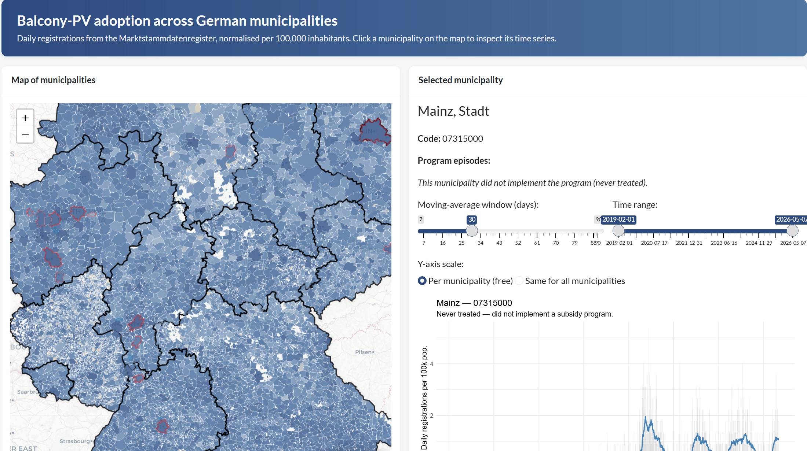
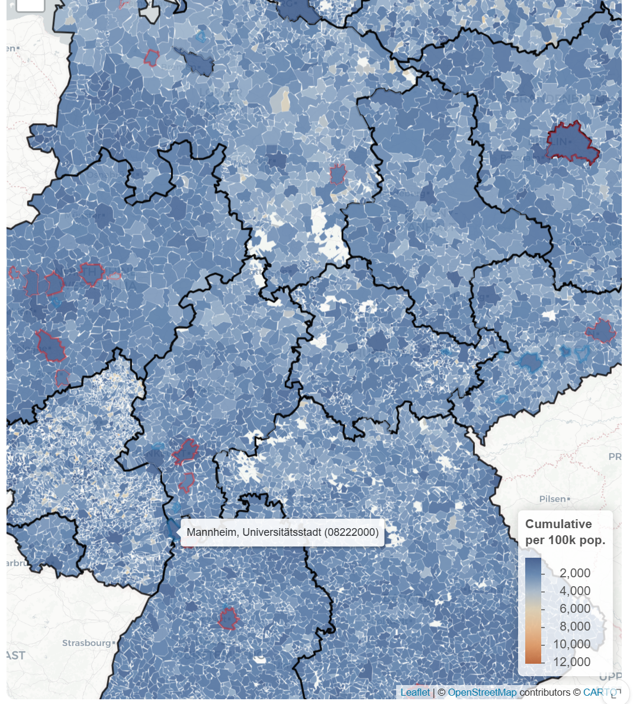
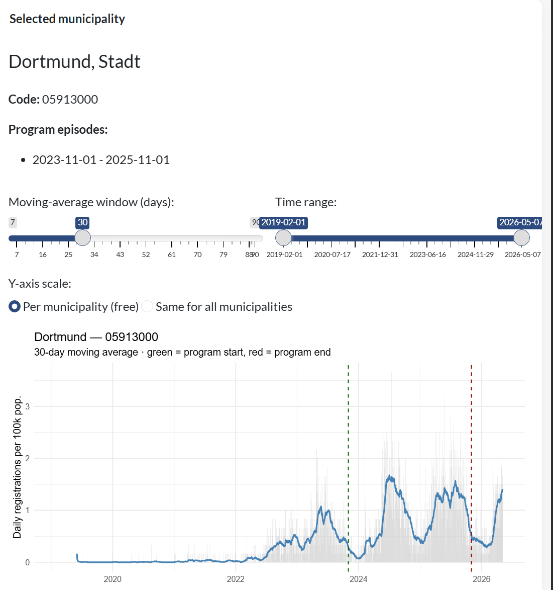

# Balcony-PV adoption across German municipalities

An interactive Shiny app for exploring **balcony-PV ("Steckersolar") adoption** in every German municipality, using daily registration data from the *Marktstammdatenregister* (MaStR), normalised by 2023 municipal population (per 100,000 inhabitants).

Built as a companion to the writing-sample paper on the causal effect of municipal balcony-PV subsidy programs.

---

## What the app looks like

Two panels side by side:

- **Left** — a leaflet map of all \~10,700 German municipalities.
- **Right** — a daily time-series for whichever municipality you select on the map.

Before you click anywhere, the right panel defaults to **Heidelberg (AGS `08221000`)**.

---

## The map (left panel)

**Colours and borders:**

- **Fill colour** = cumulative balcony-PV registrations per 100,000 inhabitants. Deeper orange = higher adoption; deeper blue = lower. The legend in the bottom-right shows the scale.
- **Red border** = the municipality ran a balcony-PV subsidy program at some point (the *treated* group in the DiD analysis).
- **Thin white border** = never-treated control.
- **Black border** = federal-state (Bundesland) boundary, drawn on top.

**How to interact:**

- *Hover* a municipality to see its name and 8-digit AGS code, e.g. `Heidelberg (08221000)`.
- *Click* a municipality to load its time series in the right panel.
- Drag, zoom, and use the layer controls as in any leaflet map.

Only one label is shown at a time — labels disappear as you move on, so the map stays clean.

---

## The time-series plot (right panel)

For the selected municipality, the plot shows:

- **Grey bars** — daily registrations per 100,000 inhabitants.
- **Blue line** — moving average of the daily series. Hover the line to see the exact daily and MA values at a given date.
- **Dashed green vertical line** — start of a subsidy program (for treated municipalities).
- **Dashed red vertical line** — end of the program.

If the selected municipality is a **control** (never ran a program), the subtitle says so explicitly and no vertical lines are drawn.

**Controls above the plot:**

- *Moving-average window (days)* — slider from 7 to 90 days, default 30. Wider window = smoother line.
- *Time range* — restrict the x-axis to a window of dates.
- *Y-axis scale* — radio button:
  - **Per municipality (free)** *(default)* — each plot auto-fits its own data; best for inspecting one municipality on its own.
  - **Same for all municipalities** — fixes the y-axis to the maximum observed among the treated municipalities, so you can compare adoption levels across selections.

Each card has a small **expand icon** in its bottom-right corner — click it to make the map or the plot full-screen.

---

## Files in this folder

| File | Purpose |
|------|---------|
| `2. shiny app.qmd` | The Shiny app itself (Quarto + `shiny::shinyApp(ui, server)`) |
| `1. dataset.qmd.qmd` | Quarto pipeline that builds the parquet datasets the app reads |
| `municipalities.parquet` | Municipality boundary geometries (2023 vintage) |
| `federalState.parquet` | Federal-state boundary geometries |
| `outcome_variable.parquet` | Daily MaStR registrations panel, joined with 2023 population |
| `data.treatment.parquet` | Monthly treatment indicator for ever-treated municipalities |
| `pop.muni.parquet` | Annual population per municipality, 2012–2023 |

---

## How to run locally

1. Open the project in RStudio.
2. Open `2. shiny app.qmd`.
3. Run the chunk. On first run, `pacman::p_load(...)` installs any missing packages (`shiny`, `leaflet`, `bslib`, `ggiraph`, `sfarrow`, ...).
4. The app opens in your browser.

To re-build the data from scratch (only needed if you want to change the underlying inputs), run `1. dataset.qmd.qmd` first.
